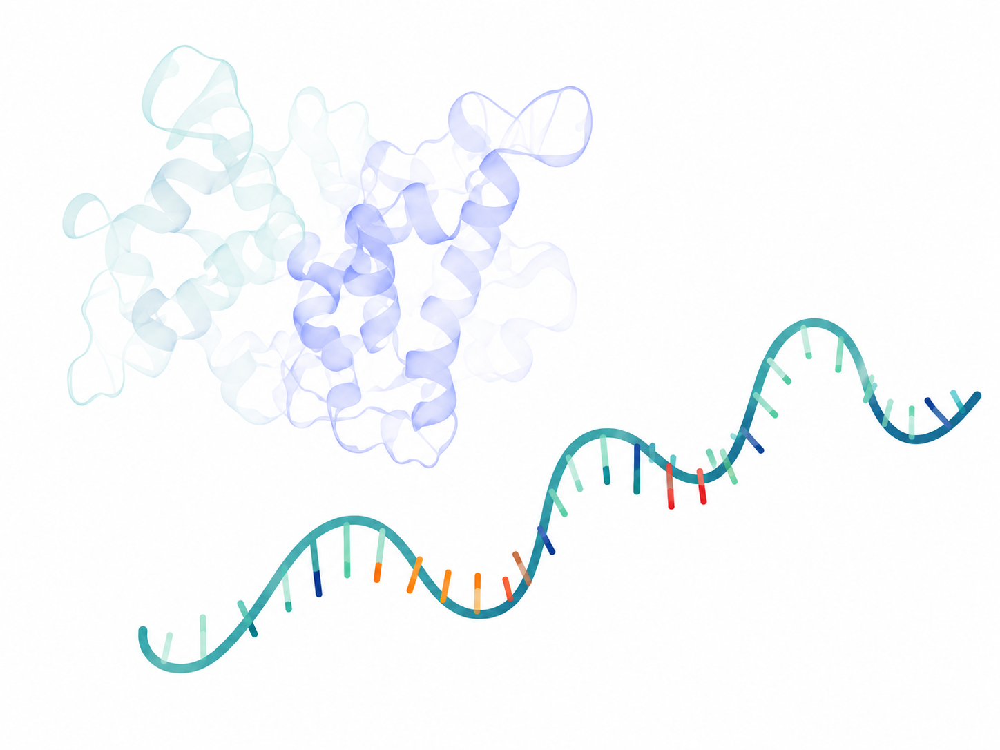
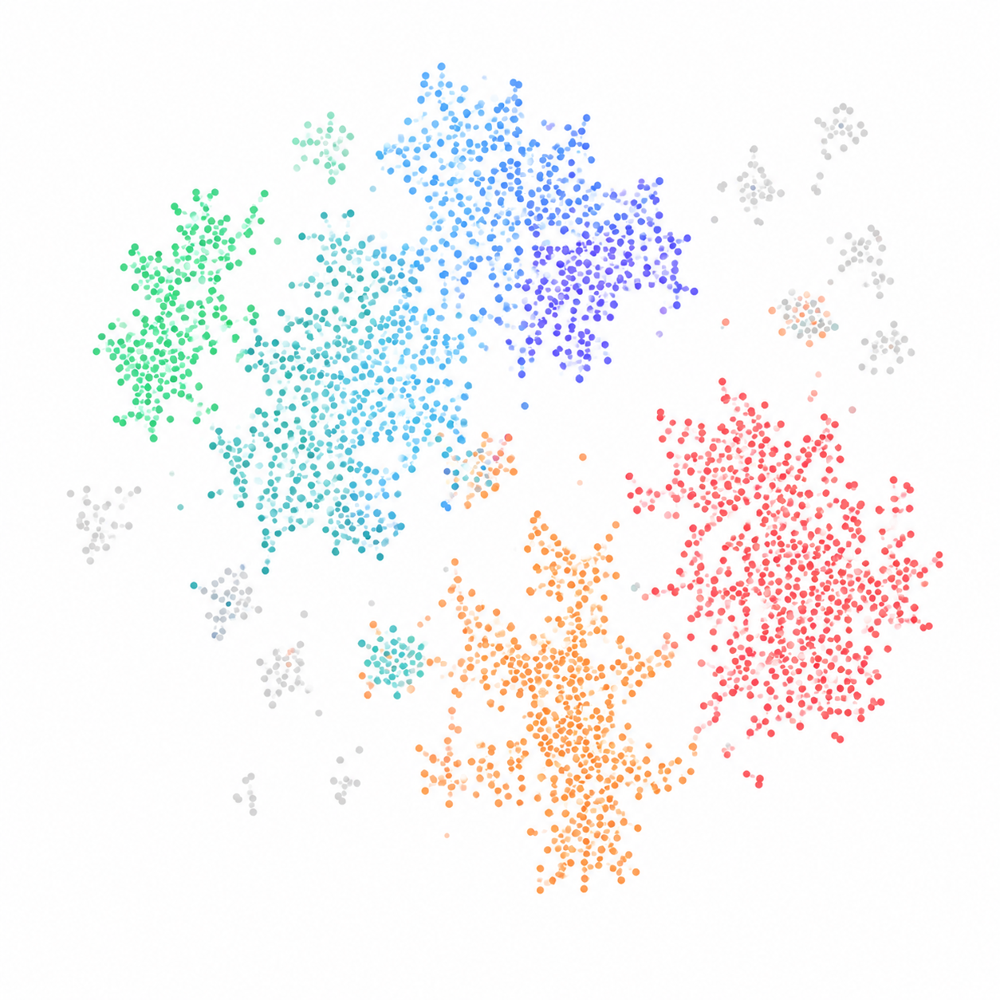

---
hide:
  - navigation
  - toc
  - footer
---

  <section class="mtd-hero-v2">

    

  

    

      

      <h1 class="mtd-hero-v2-title">
        Explore the full depth of host–microbe interactions
        from RNA-seq data.
      </h1>

      

        MTD Explorer is a suite of tools for profiling host and microbial
        transcriptomes, functional activity, and their integration from
        high-throughput sequencing data.
      

      

        <a
          href="getting-started/quick-start/"
          class="md-button md-button--primary"
        >
          Get started
        </a>

        <a
          href="getting-started/installation/"
          class="md-button"
        >
          View documentation
        </a>

      

      

        
          <i class="mtd-base-dot mtd-base-dot-a">A</i>
          Adenine
        

        
          <i class="mtd-base-dot mtd-base-dot-c">C</i>
          Cytosine
        

        
          <i class="mtd-base-dot mtd-base-dot-g">G</i>
          Guanine
        

        
          <i class="mtd-base-dot mtd-base-dot-t">U/T</i>
          Uracil / Thymine
        

      

    

   

  

  </section>

  <section class="mtd-cards-v2">

    <article class="mtd-card-v2">

      

        
      

      

        <h3>Host transcriptome</h3>

        

          Quantify host gene expression and isoforms with precision.
        

        <a href="user-guide/">
          Learn more →
        </a>
      

    </article>

    <article class="mtd-card-v2">

      

        
      

      

        <h3>Microbial community</h3>

        

          Profile microbial abundance and strain-level transcription.
        

        <a href="user-guide/">
          Learn more →
        </a>
      

    </article>

    <article class="mtd-card-v2">

      

        
      

      

        <h3>Functional activity</h3>

        

          Infer functional pathways and metabolic activity.
        

        <a href="user-guide/">
          Learn more →
        </a>
      

    </article>

    <article class="mtd-card-v2">

      

        
      

      

        <h3>Integrated exploration</h3>

        

          Jointly explore host, microbe, and function in one framework.
        

        <a href="user-guide/">
          Learn more →
        </a>
      

    </article>

  </section>

  <section class="mtd-workflow-v2">

    

      <h2>Workflow overview</h2>

      

        From raw reads to biological insights in five simple steps.
      

    

  

    
    <strong>1. Input data</strong>
    <small>RNA-seq reads and metadata</small>
  

  
→

  

    
    <strong>2. Process</strong>
    <small>Align, assemble &amp; quantify</small>
  

  
→

  

    
    <strong>3. Explore</strong>
    <small>Browse results &amp; visualize</small>
  

  
→

  

    
    <strong>4. Integrate</strong>
    <small>Combine host, microbe &amp; function</small>
  

  
→

  

    
    <strong>5. Interpret</strong>
    <small>Draw conclusions &amp; generate insights</small>
  

  </section>

